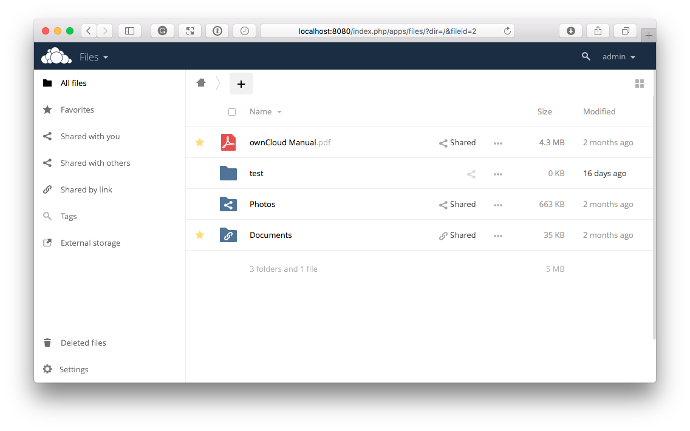

## Connecting to an ownCloud server using a desktop or mobile client

To connect to an ownCloud server, follow these steps:
1. Open your Web browser.
2. Enter the location of your ownClould server, ensuring you specify 8080 as the port number. For example, https://*ServerIPaddress*:8080/, where *ServerIPaddress* should be replaced by your ownCloud server's IP address.
3. Specify your username and password. The ownCloud server administrator should have provided your initial password. You can change your password once connected. The main user interface is displayed. 

For details on navigating the user interface, click [here](https://doc.owncloud.com/server/user_manual/webinterface.html)/
